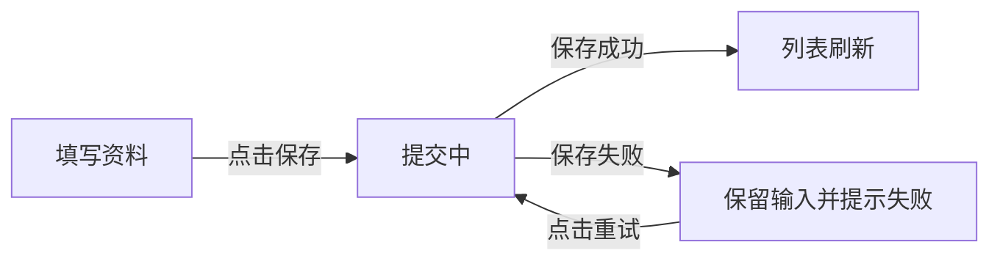

# Mermaid 交互、控制流与数据流

用户要求图示，或文字难以讲清分支、时序、状态及数据传递时使用。图说明产品行为，保留必要规则和验收文字；一个图只讲一个任务，简单单步操作无需配图。

| 要解释的关系 | 图型与重点 |
| --- | --- |
| 用户操作、条件判断、成功／异常恢复 | `flowchart TD` / `LR`；边写点击动作或自动触发条件，分支写清条件 |
| 用户、页面、产品对象之间的交互先后 | `sequenceDiagram`；参与者用产品称谓，必要时用 alt / else 表达分支 |
| 状态及允许的控制流转 | `stateDiagram-v2`；边写事件／条件，不把阅读导航当业务流转 |
| 数据来源、加工、保存、刷新去向 | `flowchart LR`；节点写产品对象，边写数据或更新动作，不猜接口、队列、数据库表 |

图中名称沿用 PRD、页面状态与控件文案；同一操作要与 `actions` / `transitions` 一致。未决行为用 `Q1：待确认…` 节点或边标识，不能连成已确认的成功分支。数据流向和页面跳转不是同一回事，必要时分两张图。

## PRD 写法与复用

在相关流程段落写标题、简短读图说明和标准 `mermaid` 围栏。中文和含特殊符号的节点标签用双引号包裹，内部 ID 用简短英文；长文放图外，避免一个节点塞满规则。选择少量必要分支，宽图可改为 TD 或按子任务拆图。

下面仅示范已确认“保存成功刷新列表，失败保留输入可重试”的需求，不是默认业务规则：

````markdown
### 保存资料

用户提交后等待保存结果；失败保留输入，可重新提交。

<!-- pm-draw:diagram save-flow -->

````

`<!-- pm-draw:diagram save-flow -->` 是稳定图编号，紧邻围栏之前，中间允许空行；PRD 内不重复。标准 Markdown 查看器可按自身的 Mermaid 支持直接显示图，不支持时仍有标题、文字与源码。图的 `accTitle` / `accDescr` 可补充无障碍说明。

HTML 原型的组或屏幕直接引用，源码只维护在 PRD：

```json
"diagrams": [{ "prd": "save-flow" }]
```

同组多个页面共享的流程放组级，只涉及一个页面的交互或数据关系放屏级。不必把 PRD 所有图再次引用到组里；总索引自动展示全部 PRD 图。分组文件也使用相同字段。

需要补充原型特有、业务含义已在 PRD 中明确的说明时，可内联：

```json
"diagrams": [{
  "id": "save-sequence",
  "title": "保存时的交互顺序",
  "description": "提交后更新资料记录，再刷新列表显示。",
  "source": "sequenceDiagram\n  actor User as 用户\n  participant Page as 页面\n  participant Record as 资料记录\n  User->>Page: 点击保存\n  Page->>Record: 保存当前输入\n  Record-->>Page: 保存成功\n  Page-->>User: 列表显示更新后的资料"
}]
```

source 不含围栏，不嵌 HTML、图片、外部链接、click 回调或图内配置。沿用中性灰与雾蓝主题，语义依靠文字而非颜色。图示不会执行保存或自动生成页面跳转，真实原型链接仍在 actions / transitions 中维护。

## HTML 显示与校验

build 自动提取 PRD 图到总索引，在组开头／页面画布下方显示对应 diagrams。每张图提供适应宽度、放大／缩小、原始大小、展开与复制源码；默认缩放不低于 75%，窄屏保留可读字号，超宽图在图内滚动，不挤压产品画布；点击“适应宽度”可缩小查看全图。默认显示 SVG，源码折叠；JavaScript 不可用或单图语法错误时保留源码和提示，其他图及反馈继续工作。

Mermaid 11.17.2 随 skill 本地提供，只在含图页面内嵌，不从 CDN 加载，无需 npm 安装。HTML 保持可直接离线打开。使用 `strict` 安全模式与统一主题，不启用图内配置覆盖。

先运行 validate / build，再实际打开 HTML 检查渲染结果，尤其是中文、特殊符号、分支标签和窄屏。CLI 校验图示结构与引用；Mermaid 完整语法在浏览器校验。不能因 build 成功就声称所有图正确，出现错误需修源码后重建。业务变化先更新 PRD；仅改变图的布局或表达不重置审批。页面引用图变化参与页面内容摘要，PRD／组图变化参与反馈版本校验。

API 与语法依据：[Mermaid 官方用法](https://mermaid.js.org/config/usage.html)、[流程图](https://mermaid.js.org/syntax/flowchart.html)、[时序图](https://mermaid.js.org/syntax/sequenceDiagram.html)、[状态图](https://mermaid.js.org/syntax/stateDiagram.html)。
